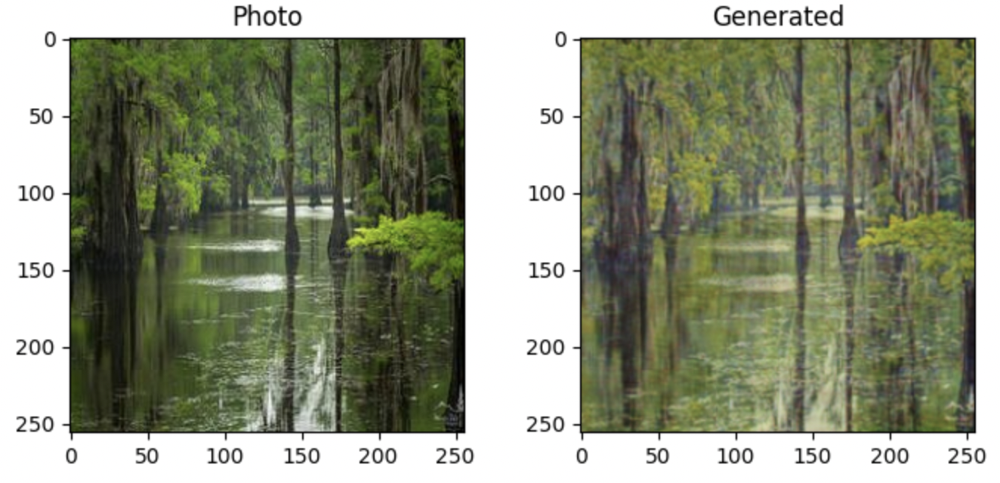
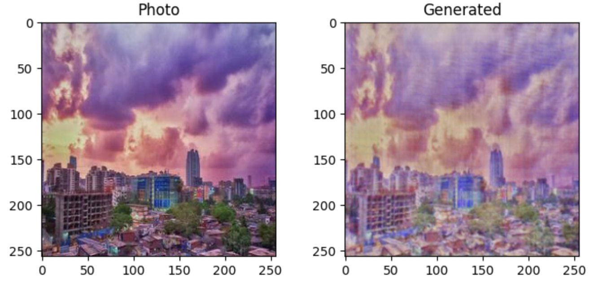
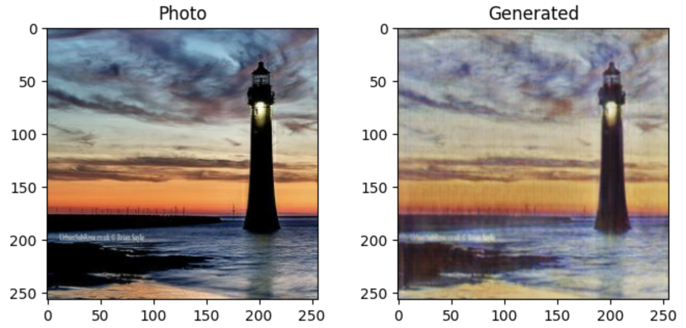
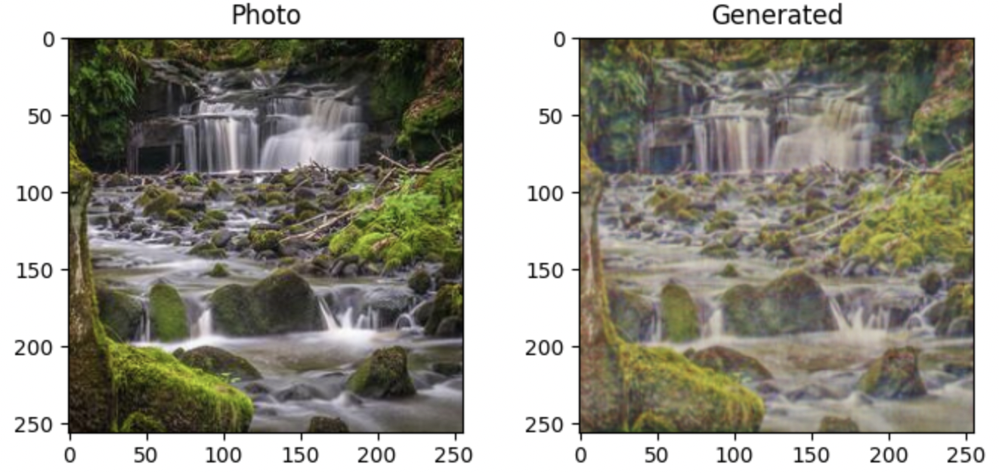
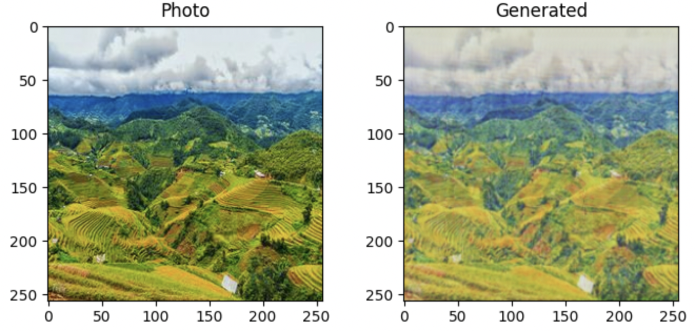

# Monet Generator

The goal of this project is to generate 7000+ **monet-style paintings from photos**.  
(Input data and challenge from Kaggle: https://www.kaggle.com/competitions/gan-getting-started/).  

## Result

Here are some example images I generated:

## Background

The backbone of this project is a Generative Adversarial Network (GAN). A GAN consists of a generator and a discriminator who work against each other. The generator attempts to trick the discriminator, while the discriminator tries to accurately classify the real vs. generated images.

## How to Use

1. Make sure you've installed all the necessary packages in the **Setup** section of painter.ipynb. Running this notebook doesn't require GPU or TPU.
2. Code for saving and restoring checkpoints are provided in the notebook to help training the model over a large number of epochs.
3. I've listed all my experiments by the end of the notebook, using **the deep architecture for generator and training for 25+ epochs** is recommended.

## Next Steps

One possible implementation is a web app that allows user to upload a photo and outputs the monet-style painting of that photo. </ br>
To achieve this, there are several steps:
1. Create a python script that corresponds to the notebook and involves the saved checkpoint path
2. Backend implementation that triggers running the python script after the user uploads a photo
3. Slight modification to the **visualization** part of the notebook and connect to the web app to display the output image

